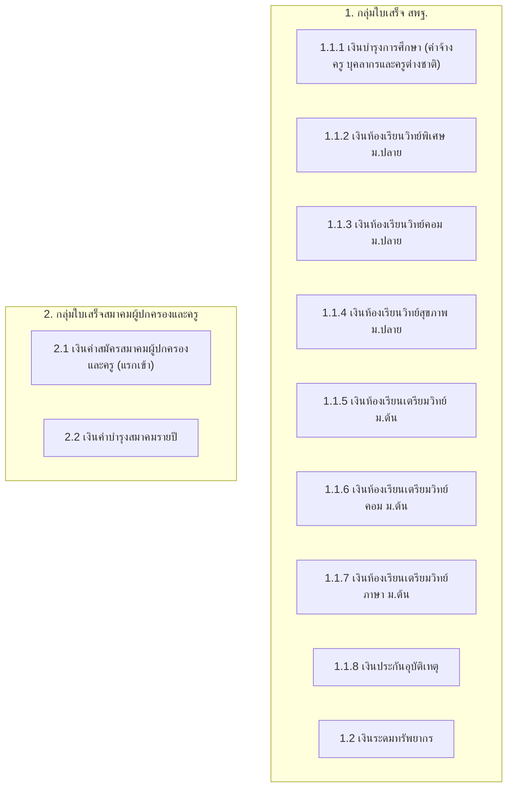
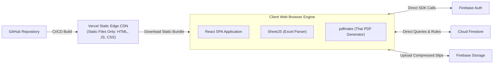

# 🏫 Hongson-SchoolPay

> **ระบบติดตามการชำระและค้างชำระเงินบำรุงการศึกษา และเงินสมาคมผู้ปกครองและครู**  
> *A Modern, Cloud-Native School Fee Tracking & Official Government Memorandum Generation Platform*

[](https://vitejs.dev/)
[](https://react.dev/)
[](https://www.typescriptlang.org/)
[](https://firebase.google.com/)
[](https://vercel.com/)
[](#-สถาปัตยกรรมระบบ-zero-vercel-compute)
[](LICENSE)

---

## 📖 สารบัญ (Table of Contents)
- [ภาพรวมโครงการ (Overview)](#-ภาพรวมโครงการ-overview)
- [จุดเด่นและปัญหาที่ระบบเข้ามาแก้ไข (Key Highlights)](#-จุดเด่นและปัญหาที่ระบบเข้ามาแก้ไข-key-highlights)
- [โครงสร้างประเภทเงิน (Fee Structure)](#-โครงสร้างประเภทเงิน-fee-structure)
- [ฟังก์ชันการทำงานตามบทบาทผู้ใช้ (Features by Role)](#-ฟังก์ชันการทำงานตามบทบาทผู้ใช้-features-by-role)
- [สถาปัตยกรรมระบบ: Zero Vercel Compute](#-สถาปัตยกรรมระบบ-zero-vercel-compute)
- [ระบบยืนยันตัวตนและการเชื่อมต่อ (Auth Bridge & RBAC)](#-ระบบยืนยันตัวตนและการเชื่อมต่อ-auth-bridge--rbac)
- [แบบฟอร์มบันทึกข้อความราชการ สพฐ. (Official Memo)](#-แบบฟอร์มบันทึกข้อความราชการ-สพฐ-ตราครุฑ-official-memo)
- [โครงสร้างฐานข้อมูล (Firestore Schema)](#-โครงสร้างฐานข้อมูล-firestore-schema)
- [แผนการพัฒนา (Implementation Roadmap)](#-แผนการพัฒนา-implementation-roadmap)
- [เอกสารอ้างอิง (Documentation Links)](#-เอกสารอ้างอิง-documentation-links)

---

## 🎯 ภาพรวมโครงการ (Overview)

**Hongson-SchoolPay** เป็นแพลตฟอร์มเว็บแอปพลิเคชันที่พัฒนาขึ้นเพื่อยกระดับการบริหารจัดการเงินบำรุงการศึกษาของโรงเรียน โดยครอบคลุมตั้งแต่การตั้งยอดหนี้รายบุคคล, การติดตามยอดค้างชำระรายห้องเรียน, การรับชำระและออกใบเสร็จรับเงิน 2 เล่มแยกประเภท (สพฐ. และ สมาคมผู้ปกครองและครู), การเชื่อมโยงข้อมูลทะเบียนนักเรียนเพื่อปรับปรุงยอดหนี้กรณีย้ายห้องหรือลาออก ไปจนถึง **การสร้างบันทึกข้อความราชการ สพฐ. ตราครุฑ เสนอฝ่ายบริหารในคลิกเดียว (1-Click Official Memo Generator)**

ตัวระบบถูกออกแบบภายใต้ข้อกำหนดการใช้ทรัพยากรแบบ **Zero Vercel Server Compute ($0 Cost)** รันบน Vercel Free Tier ได้ถาวร โดยอาศัยการประมวลผลบนเบราว์เซอร์ผู้ใช้และการเรียกใช้ Firebase Client SDK โดยตรง

---

## 🌟 จุดเด่นและปัญหาที่ระบบเข้ามาแก้ไข (Key Highlights)

| ปัญหาเดิมของโรงเรียน | สิ่งที่ Hongson-SchoolPay เข้ามาแก้ปัญหา |
| :--- | :--- |
| **ยอดหนี้ค้างลอยจากนักเรียนย้ายห้อง/ลาออก:** เมื่อนักเรียนย้ายห้องหรือลาออก ข้อมูลทะเบียนกับการเงินไม่เชื่อมกัน ทำให้ยอดค้างยังติดอยู่ในห้องเดิม | **ระบบ Student Lifecycle & Debt Void:** โอนย้ายหนี้ไปยังห้องใหม่ทันทีเมื่อย้ายห้อง และตัดหนี้สูญ (`waived/void`) อัตโนมัติเมื่อลาออก ข้อมูลไม่คลาดเคลื่อน |
| **ความสับสนในการแยก 2 เล่มใบเสร็จ:** โรงเรียนมีทั้งเงินบำรุงการศึกษา (สพฐ.) และเงินสมาคมฯ ซึ่งต้องทำบัญชีแยกกัน | **Dual-Series Receipt Engine:** ระบบแยกหมวดหนี้และออกใบเสร็จรับเงินแยกรันนัมเบอร์ 2 เล่มชัดเจน (`สพฐ.-xxxx` และ `สมค.-xxxx`) |
| **ภาระงานพิมพ์บันทึกข้อความราชการ:** คุณครูที่ปรึกษาต้องนั่งพิมพ์รายงาน Word ทุกเทอม ตารางตัวเลขคลาดเคลื่อนง่าย | **1-Click Official Memo Generator:** ดึงข้อมูลเด็กค้าง ยอดเงิน และเหตุผล มาจัดเรียงลงในฟอร์มบันทึกข้อความ สพฐ. ตราครุฑ 3 ซม. สั่งพิมพ์/โหลด PDF ได้ทันที |
| **ครูติดตามผู้ปกครองได้ยาก:** ครูไม่มีประวัติว่าเคยคุยกับผู้ปกครองคนไหนเมื่อไหร่ | **Student Follow-up Journal:** บันทึก Log การติดตามผล เช่น โทรหาผู้ปกครองแล้ว นัดโอนเงินสิ้นเดือน พร้อมเบอร์ติดต่อในหน้าเดียว |
| **ค่าใช้จ่ายโฮสติ้งและเซิร์ฟเวอร์:** กังวลเรื่องค่าใช้จ่ายส่วนเกิน Cloud Service | **Client-Side Heavy Architecture:** ประมวลผลบนเครื่องผู้ใช้ทั้งหมด 100% Free-Tier Safe ทั้ง Vercel และ Firebase |

---

## 💵 โครงสร้างประเภทเงิน (Fee Structure)

ระบบรองรับโครงสร้างประเภทเงินตามระเบียบโรงเรียน แบ่งออกเป็น **2 กลุ่มใบเสร็จหลัก และ 10 ประเภทย่อย**:



* **Dynamic Fee Assignment:** สามารถตั้งค่าได้ว่าแต่ละแผนการเรียน (วิทย์พิเศษ, วิทย์คอม, ทั่วไป ฯลฯ) ต้องชำระรายการใดบ้าง ในแต่ละภาคเรียน

---

## 👥 ฟังก์ชันการทำงานตามบทบาทผู้ใช้ (Features by Role)

ระบบแบ่งออกเป็น 5 บทบาท พร้อมสิทธิ์การใช้งานที่ชัดเจน (Role-Based Access Control):

```
                                 [Hongson-SchoolPay]
                                          │
            ┌─────────────────────────────┴─────────────────────────────┐
            ▼                                                           ▼
     [Admin Side]                                                [User Side]
   ├── 👑 Superadmin (ผู้ดูแลระบบสูงสุด)                        └── 🎒 ครูที่ปรึกษา / ครูทั่วไป
   ├── 🏛️ ผู้บริหาร (ผอ. / รอง ผอ.)                                (Homeroom Teachers)
   ├── 💳 เจ้าหน้าที่การเงิน (Finance Officer)
   └── 👩‍🏫 ครูการเงิน (Finance Teacher)
```

### 1. 👑 ผู้ดูแลระบบสูงสุด (Superadmin)
* จัดการโครงสร้างระบบ และแต่งตั้งสิทธิ์ผู้ใช้งาน (Roles & Permissions)
* ตรวจสอบประวัติการดำเนินงานทั้งหมดในระบบ (Audit Trail Logs)
* จัดการข้อมูล Master Data และโครงสร้างปีการศึกษา

### 2. 🏛️ ผู้บริหารสถานศึกษา (Executive: ผอ. / รอง ผอ.)
* **Executive Financial Dashboard:** แดชบอร์ดวิเคราะห์ยอดจัดเก็บรายวัน/รายเดือน, อัตราความสำเร็จ (%), ยอดค้างชำระรายระดับชั้น
* **Executive Memo:** เรียกดูและพิมพ์บันทึกข้อความสรุปสถิติภาพรวมทั้งโรงเรียน
* พิจารณาและแทงเรื่อง/ลงนามในบันทึกข้อความรายงานการติดตามค่าเทอม

### 3. 💳 เจ้าหน้าที่การเงิน & ครูการเงิน (Finance Officers / Teachers)
* **Fee Matrix Setup:** ตั้งค่าอัตราค่าธรรมเนียมตามระดับชั้นและแผนการเรียน
* **Student Registry Sync:** นำเข้ารายชื่อนักเรียนจาก Excel (DMC / SGS) และอนุมัติการย้ายห้อง/จำหน่ายนักเรียน
* **Payment & Dual-Receipting:** บันทึกรับเงินสด ตรวจสอบสลิปโอนเงิน และออกใบเสร็จรับเงิน 2 เล่ม (`สพฐ.` และ `สมาคมฯ`)
* **Debt Voiding:** ตัดยอดหนี้สูญกรณีนักเรียนลาออก ป้องกันหนี้ค้างลอย
* **Notice Letter Generator:** สั่งพิมพ์หนังสือแจ้งเตือนผู้ปกครองพร้อม QR Code PromptPay

### 4. 🎒 คุณครูที่ปรึกษา / ครูประจำชั้น (Homeroom Teachers - ฝั่ง User)
* **Homeroom Dashboard:** ตรวจสอบยอดชำระ/ค้างชำระเฉพาะห้องที่ตนเองรับผิดชอบ (ป้ายสี เขียว-เหลือง-แดง-ฟ้า)
* **Student Tracking Journal:** บันทึกผลการติดตามผู้ปกครอง เช่น การโทรติดต่อ วันที่นัดชำระ
* **Slip Upload:** อัปโหลดสลิปที่ผู้ปกครองส่งมาในไลน์ห้องเรียน เพื่อส่งให้การเงินตรวจสอบ
* **Status Change Request:** ส่งเรื่องแจ้งนักเรียนย้ายห้อง หรือลาออก ให้การเงินกดยืนยัน
* **1-Click Official Memo Generator:** กดปุ่มเดียวสร้างบันทึกข้อความรายงานผลการติดตามค่าเทอม เสนอ ผอ. ตามระเบียบสารบรรณทันที

---

## ⚡ สถาปัตยกรรมระบบ: Zero Vercel Compute

ระบบถูกออกแบบให้ **ไม่ใช้ Serverless Function บน Vercel เลยแม้แต่น้อย (0 Invocations / $0 Cost)** เพื่อไม่ให้เกินโควตา Free Tier ของ Vercel:



* **Client-Side Heavy Processing:**
  * การนำเข้า/ส่งออก Excel ใช้ SheetJS (`xlsx`) ประมวลผลใน RAM ของเบราว์เซอร์
  * การสร้างเอกสารราชการ PDF ใช้ `pdfmake` ร่วมกับฟอนต์ **TH Sarabun PSK** แปลงในเครื่องผู้ใช้โดยตรง
  * การบีบอัดรูปภาพสลิปโอนเงิน (Image Compression) ทำใน Canvas ของเบราว์เซอร์ก่อนส่งเข้า Firebase Storage เพื่อประหยัดพื้นที่คลาวด์ได้ถึง 85%
* **Security Enforcement:** ความปลอดภัยทั้งหมดควบคุมผ่าน **Firestore Security Rules** ระดับ Document Security ไม่ต้องมี API Server คั่นกลาง

---

## 🔐 ระบบยืนยันตัวตนและการเชื่อมต่อ (Auth Bridge & RBAC)

ระบบ Hongson-SchoolPay สามารถเชื่อมโยงเข้ากับระบบ **Firebase Auth เดิมของโรงเรียน** ได้อย่างแนบเนียน:

1. **Auth Bridge Layer:** ผู้ใช้ล็อกอินผ่านบัญชีเดิม (เช่น Google Workspace โดเมนโรงเรียน หรือ Email เดิม)
2. **App-Specific Roles (`hsp_roles`):** สิทธิ์การใช้งานระบบนี้จะถูกบันทึกแยกในคอลเลกชันเฉพาะ ไม่กระทบสิทธิ์ของระบบอื่น
3. **Superadmin First-Claim Bootstrapping:** เมื่อติดตั้งระบบครั้งแรก อีเมลที่ถูกระบุไว้ใน Env Whitelist จะได้รับสิทธิ์ Superadmin โดยอัตโนมัติเพื่อเริ่มต้นตั้งค่าระบบ

---

## 📜 แบบฟอร์มบันทึกข้อความราชการ สพฐ. ตราครุฑ (Official Memo)

ระบบมีแม่แบบเอกสารบันทึกข้อความราชการตามระเบียบสำนักนายกรัฐมนตรีว่าด้วยงานสารบรรณ (ตราครุฑ 3 ซม., ฟอนต์ TH Sarabun PSK 16pt, จัดตารางรายชื่อเด็กค้างชำระ ยอดเงิน สพฐ./สมาคมฯ และเหตุผล):

```
+--------------------------------------------------------------------------+
|                            [ ตราครุฑ 3 ซม. ]                            |
|                              บันทึกข้อความ                               |
| ส่วนราชการ: โรงเรียน.................................................... |
| ที่: ศธ ๐๔xxx/..............              วันที่: .. เดือน ......... พ.ศ. ๒๕๖๙ |
| เรื่อง: รายงานผลการติดตามการชำระเงินบำรุงการศึกษาและเงินสมาคมผู้ปกครองและครู |
|         ภาคเรียนที่ .../๒๕๖๙ ประจำห้องเรียนชั้นมัธยมศึกษาปีที่ ...../.....    |
| เรียน: ผู้อำนวยการโรงเรียน.............................................. |
|                                                                          |
| ๑. สรุปผล: มีนักเรียนทั้งหมด ..... คน ชำระแล้ว ..... คน คงค้าง ..... คน    |
| ๒. ตารางรายละเอียดนักเรียนที่ค้างชำระเงิน (แยกยอด สพฐ. และ สมาคมฯ):        |
|    [ ดึงข้อมูลอัตโนมัติจากฐานข้อมูล ไม่ต้องพิมพ์มือ ]                    |
| ๓. ปัญหา อุปสรรค และผลการประสานงานผู้ปกครอง: .........................   |
|                                                                          |
|                                      (ลงชื่อ)........................... |
|                                              ครูที่ปรึกษา                |
| ------------------------------------------------------------------------ |
| ความเห็นฝ่ายบริหาร: [ ] ทราบ  [ ] มอบหมายฝ่ายการเงินดำเนินการ........... |
+--------------------------------------------------------------------------+
```

---

## 🗄️ โครงสร้างฐานข้อมูล (Firestore Schema)

* `/hsp_roles/{uid}` : สิทธิ์และบทบาทของผู้ใช้งาน (`role`, `assignedRooms`, `status`)
* `/hsp_academic_years/{yearId}/terms/{termId}` : ข้อมูลปีการศึกษาและภาคเรียน
* `/hsp_fee_items/{feeItemId}` : รายการประเภทเงิน (สพฐ. 10 รายการ + สมาคมฯ 2 รายการ)
* `/hsp_students/{studentId}` : ข้อมูลนักเรียน สถานะ และประวัติห้องเรียน
* `/hsp_invoices/{invoiceId}` : ภาระหนี้รายบุคคล แยกยอด สพฐ. และ สมาคมฯ
* `/hsp_payments/{paymentId}` : ประวัติการรับชำระเงิน สลิปโอน และรหัสใบเสร็จ
* `/hsp_official_memos/{memoId}` : บันทึกข้อความราชการที่สร้างไว้
* `/hsp_status_requests/{requestId}` : คำร้องแจ้งย้ายห้อง/ลาออก/ขอผ่อนผัน
* `/hsp_audit_logs/{logId}` : ประวัติการบันทึกและแก้ไขข้อมูลทางการเงิน

---

## 🗺️ แผนการพัฒนา (Implementation Roadmap)

ระบบใช้กลยุทธ์ **"Feature-First, Auth-Bridge-Last"** เพื่อให้พัฒนาและทดสอบฟังก์ชันสำคัญได้ทันที โดยเชื่อมต่อ Auth Bridge ในเฟสสุดท้าย:

* **[Phase 1] โครงสร้างพื้นฐาน, UI Shell & Dev Role Switcher:** ติดตั้ง Vite + React + Tailwind และปุ่มสลับบทบาทจำลอง 5 สิทธิ์
* **[Phase 2] Fee Master Data & Invoicing Engine:** จัดการประเภทเงิน สพฐ. 10 รายการ + สมาคมฯ 2 รายการ และระบบคำนวณหนี้อัตโนมัติ
* **[Phase 3] Student Registry Sync & Lifecycle:** นำเข้า Excel นักเรียน, ระบบย้ายห้อง และระบบตัดหนี้สูญเมื่อลาออก
* **[Phase 4] Payment Tracking, Dual-Receipts & Homeroom Portal:** หน้าจอครูดูยอดค้างรายห้อง, ออกใบเสร็จ 2 เล่ม และพิมพ์หนังสือเตือนผู้ปกครอง
* **[Phase 5] 1-Click Official Memo Generator & Analytics:** ระบบสร้างบันทึกข้อความราชการ สพฐ. ตราครุฑ และ Dashboard ผู้บริหาร
* **[Phase 6 (Final)] Auth Bridge Integration & Production Deploy:** นำ Firebase Auth เดิมของโรงเรียนมาเสียบเชื่อมต่อ, เปิดใช้ RBAC จริง, ติดตั้ง Security Rules และ Deploy สู่ Vercel

---

## 📚 เอกสารอ้างอิง (Documentation Links)

* 📘 **[blueprint.md](file:///d:/Hongson-SchoolPay/blueprint.md):** เอกสารพิมพ์เขียวสถาปัตยกรรมระบบฉบับเต็ม โค้ด Firestore Rules และตารางวิเคราะห์ต้นทุน
* 📋 **[implementation_plan.md](file:///d:/Hongson-SchoolPay/implementation_plan.md):** แผนการพัฒนาเชิงปฏิบัติการ 6 เฟส พร้อมรายการ Checklist ที่ผู้ใช้ต้อง Input
* 🖼️ **[requirement.jpg](file:///d:/Hongson-SchoolPay/requirement.jpg):** เอกสารความต้องการเริ่มต้นของระบบ
