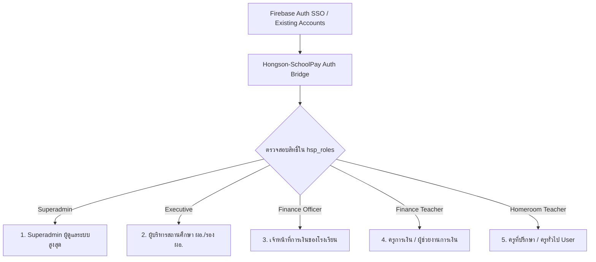
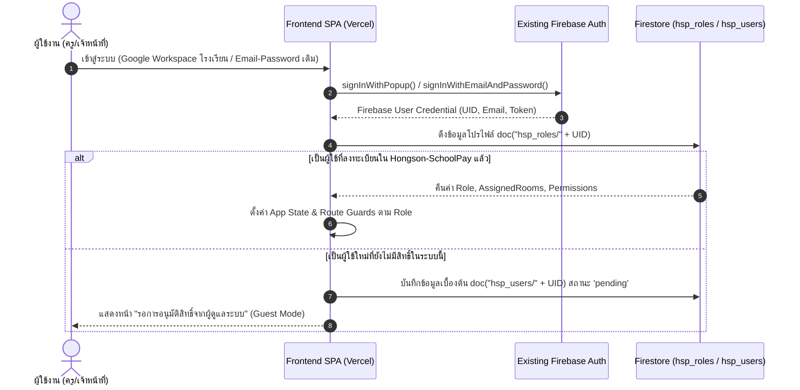
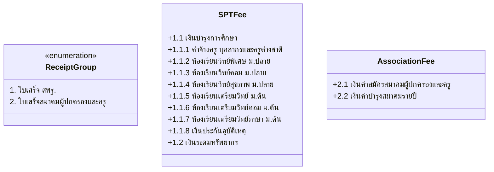
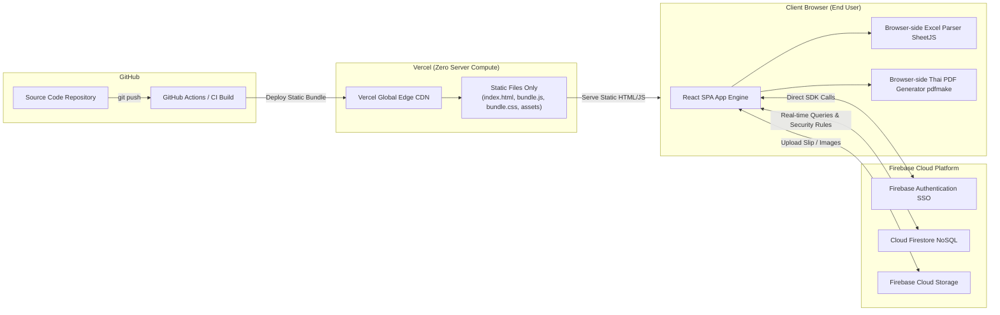
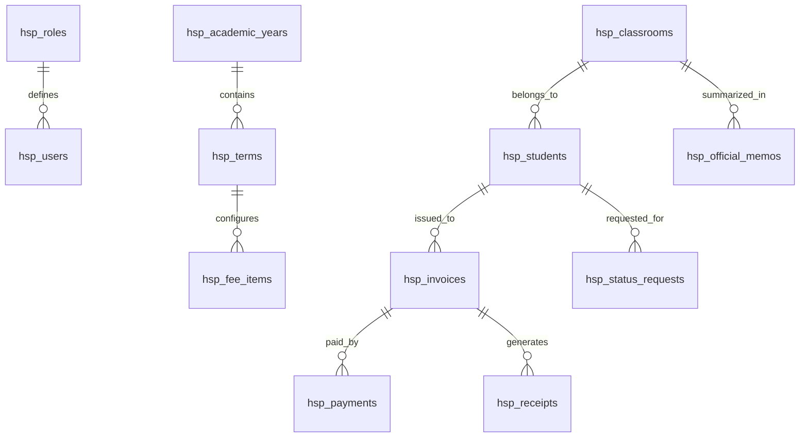
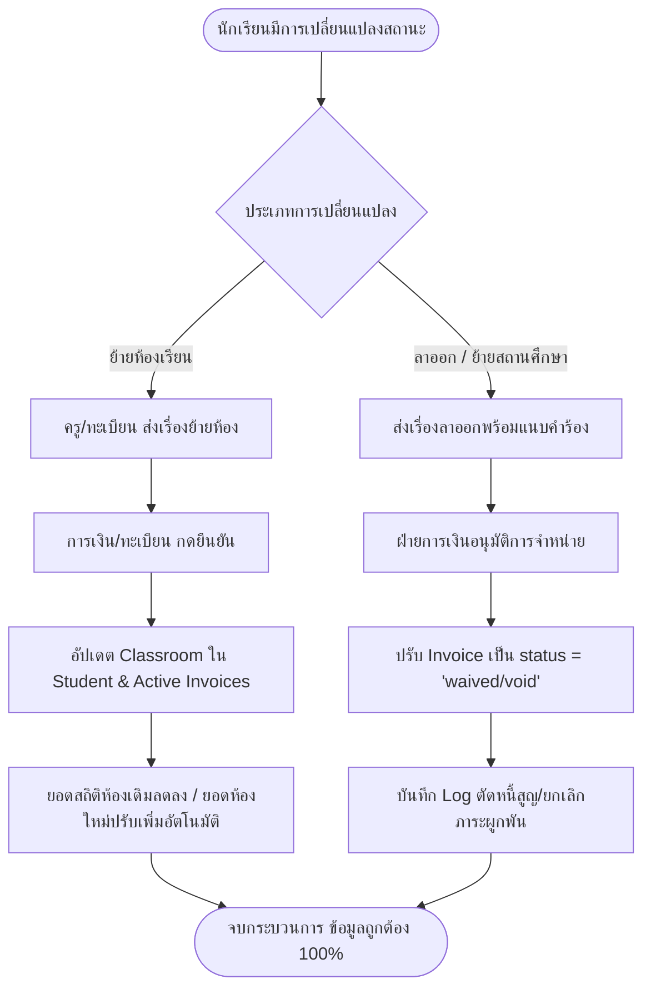
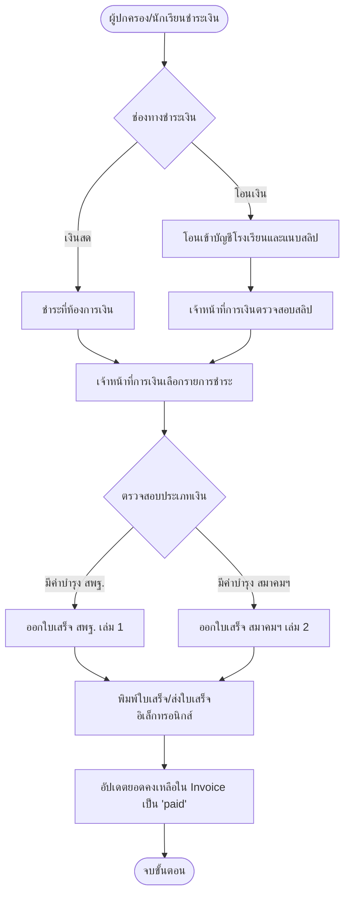

# พิมพ์เขียวสถาปัตยกรรมและแผนการพัฒนาระบบ (System Architecture & Blueprint)
## โครงการ: Hongson-SchoolPay (ระบบติดตามการชำระและค้างชำระเงินบำรุงการศึกษาและเงินสมาคมผู้ปกครองและครู)

---

## 1. บทสรุปผู้บริหารและภาพรวมโครงการ (Executive Summary)

### 1.1 ความเป็นมาและปัญหาเดิม (Problem Statement)
การบริหารจัดการเงินบำรุงการศึกษาและเงินสมาคมผู้ปกครองและครูของสถานศึกษา มักประสบปัญหาความล่าช้า ข้อมูลไม่ตรงกัน และภาระงานเอกสารซ้ำซ้อน:
1. **ความคลาดเคลื่อนของข้อมูลนักเรียน:** เกิดกรณีนับยอดค้างชำระซ้ำซ้อนจากนักเรียนที่ย้ายห้องเรียน ลาออก หรือย้ายสถานศึกษา แต่ข้อมูลฝ่ายทะเบียนยังไม่เชื่อมโยงกับฝ่ายการเงิน ทำให้ยอดหนี้ค้างลอยในระบบ
2. **ความยุ่งยากในการแยกประเภทเงิน:** โรงเรียนมีทั้ง **"ใบเสร็จ สพฐ."** (เงินบำรุงการศึกษา ค่าจ้างครู ห้องเรียนพิเศษ ประกันอุบัติเหตุ ระดมทรัพยากร) และ **"ใบเสร็จสมาคมผู้ปกครองและครู"** (ค่าสมัคร ค่าบำรุงรายปี) ซึ่งมักถูกบันทึกรวมกันจนกระทบยอดบัญชีแยกประเภทได้ยาก
3. **ภาระงานจัดทำบันทึกข้อความราชการ:** คุณครูที่ปรึกษาต้องจัดพิมพ์ "บันทึกข้อความรายงานการติดตามค่าเทอม" เสนอฝ่ายบริหารด้วยตนเองในโปรแกรมประมวลผลคำ (Word) ซึ่งเสียเวลา ตารางข้อมูลผิดพลาด และไม่มีรูปแบบมาตรฐาน
4. **ข้อจำกัดด้านงบประมาณและโครงสร้างพื้นฐาน:** ความต้องการใช้งาน Cloud Platform โดยไม่ให้มีค่าใช้จ่ายส่วนเกิน (Zero-cost / Free Tier Maintenance) และสามารถเชื่อมโยงระบบเข้ากับฐานข้อมูลบัญชีผู้ใช้เดิมของโรงเรียนที่มีอยู่แล้ว

### 1.2 วัตถุประสงค์ของระบบ (Objectives)
1. ติดตามสถานะการชำระเงินและยอดค้างชำระแบบ Real-time แยกรายห้องเรียนและแยกตามประเภทเงินได้อย่างถูกต้อง 100%
2. จัดทำ **"ระบบบันทึกข้อความราชการอัจฉริยะ (1-Click Official Memo Generator)"** ตามระเบียบสำนักนายกรัฐมนตรีว่าด้วยงานสารบรรณ พิมพ์เสนอผู้บริหารได้ทันที
3. ซิงค์สถานะนักเรียนกับงานทะเบียน (ย้ายห้อง, ลาออก, พักการเรียน) พร้อมปรับปรุงยอดหนี้ (Prorated / Debt Void) อัตโนมัติ
4. เชื่อมโยงบัญชีผู้ใช้กับ Firebase Auth เดิมของโรงเรียน (Auth Bridge) พร้อมระบบกำหนดสิทธิ์เฉพาะของ Hongson-SchoolPay
5. ใช้สถาปัตยกรรม **Client-Side Heavy SPA (Vite + React) บน GitHub + Firebase + Vercel** โดยมี **Vercel Server Compute = 0** เพื่อให้อยู่ใน Free Tier ตลอดไป

---

## 2. กลุ่มผู้ใช้งานและสิทธิ์การเข้าถึง (Stakeholder & RBAC Matrix)

ระบบแบ่งผู้ใช้งานออกเป็น 2 ฝั่งหลัก (Admin และ User) โดยมี 5 บทบาท (Roles) ชัดเจน:



### 2.1 ตารางเมทริกซ์สิทธิ์การใช้งาน (Permissions Matrix)

| ฟังก์ชันการทำงาน (Feature) | Superadmin | ผู้บริหาร (Executive) | จนท.การเงิน (Finance Officer) | ครูการเงิน (Finance Teacher) | ครูที่ปรึกษา (Homeroom Teacher / User) |
| :--- | :---: | :---: | :---: | :---: | :---: |
| **จัดการโครงสร้างระบบ & สิทธิ์ผู้ใช้ (User & Roles)** |  Full | 👁️ Read | ❌ No | ❌ No | ❌ No |
| **ตั้งค่าประเภทเงิน & อัตราค่าเทอมรายแผนการเรียน** |  Full | 👁️ Read |  Full | ❌ No | ❌ No |
| **Dashboard ภาพรวมสถิติทั้งโรงเรียน** |  Full |  Full |  Full |  Full | ❌ No (เฉพาะห้องตัวเอง) |
| **Dashboard ติดตามยอดชำระเฉพาะห้องที่ปรึกษา** |  Full |  Full |  Full |  Full |  Full (เฉพาะห้องที่รับผิดชอบ) |
| **จัดการข้อมูลนักเรียน / ซิงค์งานทะเบียน** |  Full | 👁️ Read |  Full | ✏️ Write (จำกัด) | 📝 ส่งคำร้องย้าย/ลาออก |
| **บันทึกการรับชำระเงิน / อนุมัติสลิปโอนเงิน** |  Full | ❌ No |  Full |  Full | 📤 แนบส่งสลิปเพื่อรอตรวจ |
| **ออกใบเสร็จรับเงิน / ใบแจ้งหนี้ (Receipt/Invoice)** |  Full | 👁️ Read |  Full |  Full | 👁️ View & Print |
| **พิมพ์หนังสือแจ้งเตือนผู้ปกครอง (Notice Letter)** |  Full | 👁️ Read |  Full |  Full |  Full (เฉพาะห้องตัวเอง) |
| **สร้างบันทึกข้อความรายงานติดตามค่าเทอม (ห้องเรียน)** |  Full | 👁️ Read |  Full |  Full |  Full (สร้างและพิมพ์เสนอ) |
| **สร้างบันทึกข้อความรายงานสถิติเสนอฝ่ายบริหาร** |  Full | 👁️ Read |  Full | ✏️ ร่างเสนอ | ❌ No |
| **พิจารณา/ลงนามอนุมัติในบันทึกข้อความผ่านระบบ** | ❌ No |  อนุมัติ/แทงเรื่อง | ❌ No | ❌ No | ❌ No |
| **ตรวจสอบ Audit Logs (ประวัติการแก้ไขข้อมูล)** |  Full | 👁️ Read | 👁️ Read | ❌ No | ❌ No |

---

## 3. สถาปัตยกรรมระบบยืนยันตัวตน (Authentication & Auth Bridge)

โรงเรียนมีระบบ Firebase Auth เดิมอยู่แล้ว ความต้องการคือ **เชื่อมโยงบัญชีเดิมได้ และสร้างสิทธิ์ Superadmin/Admin เฉพาะสำหรับ Hongson-SchoolPay** โดยไม่กระทบโครงสร้างระบบเดิม



### 3.1 กลไก Auth Bridge และ App-Specific RBAC
1. **การเชื่อมต่อ Auth Instance:**
   - Frontend เชื่อมต่อกับ Firebase Project เดิมผ่าน Firebase Config เดียวกัน หรือหากเป็นโปรเจกต์แยก ก็สามารถทำ Multi-App Initializer ได้
   - รองรับ Google OAuth 2.0 (แนะนำ: บังคับโดเมนอีเมลโรงเรียน เช่น `@school.ac.th`)
2. **การจัดเก็บสิทธิ์เฉพาะระบบ (Decoupled Role Storage):**
   - สิทธิ์ของ Hongson-SchoolPay จะถูกบันทึกแยกไว้ในคอลเลกชัน `hsp_roles/{uid}` ใน Firestore
   - โครงสร้างเอกสาร:
     ```json
     {
       "uid": "FIREBASE_UID_12345",
       "email": "teacher.somchai@school.ac.th",
       "displayName": "นายสมชาย ใจดี",
       "role": "homeroom_teacher", 
       "assignedRooms": ["M1/1", "M4/2"],
       "isActive": true,
       "createdAt": "2026-05-15T08:00:00Z",
       "updatedBy": "SUPERADMIN_UID"
     }
     ```
3. **Superadmin Bootstrapping (การสร้าง Superadmin ครั้งแรก):**
   - **Environment Variable Whitelist:** ฝังรายชื่อ Initial Superadmin Email ในตัวแปรสภาพแวดล้อม (Frontend Build Env: `VITE_INITIAL_SUPERADMIN_EMAILS=admin@school.ac.th`)
   - เมื่อ Email ที่ตรงกันเข้าสู่ระบบครั้งแรก และระบบยังไม่มีผู้ใช้ที่เป็น Superadmin เลย Firestore Rules จะอนุญาตให้สร้างสิทธิ์ Superadmin ของตนเองได้ครั้งแรก (First-claim initialization)
   - จากนั้น Superadmin สามารถเข้าเมนู "จัดการสิทธิ์ผู้ใช้งาน" เพื่อแต่งตั้ง เจ้าหน้าที่การเงิน, ผู้บริหาร, ครูการเงิน และผูกห้องเรียนให้ครูที่ปรึกษาได้

---

## 4. โครงสร้างประเภทเงินและบัญชีรับชำระ (Fee Structure & Accounting Model)

ตามข้อกำหนดในเอกสารแนบ ([requirement.jpg](file:///d:/Hongson-SchoolPay/requirement.jpg)) ประเภทเงินของโรงเรียนแบ่งเป็น 2 กลุ่มใบเสร็จหลัก และ 10 ประเภทย่อย:



### 4.1 ตารางรายละเอียดประเภทเงิน (Fee Category Master Data)

| รหัสประเภท | กลุ่มใบเสร็จ | ชื่อรายการค่าธรรมเนียม | ระดับชั้นที่เกี่ยวข้อง | แผนการเรียนที่เกี่ยวข้อง | ลักษณะการเรียกเก็บ |
| :---: | :---: | :--- | :--- | :--- | :---: |
| **SPT-111** | 1. ใบเสร็จ สพฐ. | 1.1.1 เงินบำรุงการศึกษา (ค่าจ้างครู บุคลากรและครูต่างชาติ) | ม.1 - ม.6 | ทุกห้องเรียน / ทุกแผนการเรียน | รายภาคเรียน |
| **SPT-112** | 1. ใบเสร็จ สพฐ. | 1.1.2 เงินห้องเรียนวิทย์พิเศษ ม.ปลาย | ม.4 - ม.6 | แผนการเรียนวิทย์พิเศษ (ห้อง 1) | รายภาคเรียน |
| **SPT-113** | 1. ใบเสร็จ สพฐ. | 1.1.3 เงินห้องเรียนวิทย์คอม ม.ปลาย | ม.4 - ม.6 | แผนการเรียนวิทย์-คอมพิวเตอร์ | รายภาคเรียน |
| **SPT-114** | 1. ใบเสร็จ สพฐ. | 1.1.4 เงินห้องเรียนวิทย์สุขภาพ ม.ปลาย | ม.4 - ม.6 | แผนการเรียนวิทย์-สุขภาพ | รายภาคเรียน |
| **SPT-115** | 1. ใบเสร็จ สพฐ. | 1.1.5 เงินห้องเรียนเตรียมวิทย์ ม.ต้น | ม.1 - ม.3 | แผนการเรียนเตรียมวิทย์ | รายภาคเรียน |
| **SPT-116** | 1. ใบเสร็จ สพฐ. | 1.1.6 เงินห้องเรียนเตรียมวิทย์คอม ม.ต้น | ม.1 - ม.3 | แผนการเรียนเตรียมวิทย์-คอม | รายภาคเรียน |
| **SPT-117** | 1. ใบเสร็จ สพฐ. | 1.1.7 เงินห้องเรียนเตรียมวิทย์ภาษา ม.ต้น | ม.1 - ม.3 | แผนการเรียนเตรียมวิทย์-ภาษา | รายภาคเรียน |
| **SPT-118** | 1. ใบเสร็จ สพฐ. | 1.1.8 เงินประกันอุบัติเหตุ | ม.1 - ม.6 | ทุกห้องเรียน | รายปีการศึกษา (เทอม 1) |
| **SPT-120** | 1. ใบเสร็จ สพฐ. | 1.2 เงินระดมทรัพยากร | ม.1 - ม.6 | ตามมติคณะกรรมการสถานศึกษา | รายภาคเรียน |
| **ASC-210** | 2. สมาคมฯ | 2.1 เงินค่าสมัครสมาคมผู้ปกครองและครู | ม.1 และ ม.4 | นักเรียนเข้าใหม่แรกเข้า | จ่ายครั้งเดียว |
| **ASC-220** | 2. สมาคมฯ | 2.2 เงินค่าบำรุงสมาคมรายปี | ม.1 - ม.6 | ทุกห้องเรียน | รายปีการศึกษา |

### 4.2 ระบบ Dynamic Fee Template Engine
ระบบมีฟังก์ชันให้อนุญาตเจ้าหน้าที่การเงินกำหนดอัตราเงินในแต่ละภาคเรียน (Academic Term Fee Template):
- ระบบจะคำนวณยอดหนี้ (Invoice Generation) อัตโนมัติ โดยจับคู่ `Student.grade` + `Student.program` + `Student.entryYear`
- นักเรียน ม.1 ห้องเรียนเตรียมวิทย์ จะถูกตั้งหนี้อัตโนมัติ: `SPT-111` + `SPT-115` + `SPT-118` + `ASC-210` + `ASC-220`
- นักเรียน ม.5 ห้องเรียนวิทย์คอม จะถูกตั้งหนี้อัตโนมัติ: `SPT-111` + `SPT-113` + `SPT-118` + `ASC-220`

---

## 5. ข้อกำหนดฟังก์ชันการทำงานระบบ (Functional Specifications)

### 5.1 ฝั่งผู้ดูแลระบบและการเงิน (Admin / Finance / Executive Module)

```
[Admin Portal]
 ├── 1. Financial Analytics Dashboard (ภาพรวมการเงินทั้งโรงเรียน)
 ├── 2. Fee Structure & Term Setup (ตั้งค่าประเภทเงินและอัตราค่าธรรมเนียม)
 ├── 3. Student Registry Sync & Lifecycle (จัดการทะเบียนนักเรียนและการย้ายห้อง)
 ├── 4. Invoicing & Debt Management (ออกใบแจ้งหนี้และการตัดยอดหนี้)
 ├── 5. Payment & Receipt Recording (รับชำระเงิน, ออกใบเสร็จ, ตรวจสอบสลิป)
 ├── 6. Installments & Hardship Waivers (ผ่อนชำระและขอยกเว้น/ขอรับทุน)
 ├── 7. Executive Memo & Reports (บันทึกข้อความสรุปสถิติเสนอผู้บริหาร)
 ├── 8. User Management & Audit Trail (จัดการสิทธิ์และบันทึกประวัติการแก้ไข)
```

1. **Financial Analytics Dashboard:**
   - ตัวชี้วัดสำคัญ (KPI Cards): ยอดเรียกเก็บรวม, ยอดชำระแล้ว, ยอดค้างชำระรวม, อัตราความสำเร็จในการจัดเก็บ (%)
   - ตัวกรองมิติข้อมูล (Multi-dimension Filters): กรองตามปีการศึกษา, ภาคเรียน, ระดับชั้น (ม.1 - ม.6), ห้องเรียน, แผนการเรียน, และกลุ่มประเภทเงิน (สพฐ. / สมาคมฯ)
   - แผนภูมิวิเคราะห์: สัดส่วนการค้างชำระตามห้องเรียน (Bar Chart), สัดส่วนประเภทเงินที่ค้างชำระมากที่สุด (Donut Chart)
2. **Student Registry Sync & Lifecycle Management (แก้ปัญหานักเรียนย้ายห้อง/ลาออก):**
   - **การนำเข้าข้อมูล (Data Import):** รองรับไฟล์ Excel/CSV จากระบบ DMC / SGS / SchoolMIS โดยประมวลผลบนเบราว์เซอร์
   - **สถานะนักเรียน (Student Status Lifecycle):**
     - `active` (กำลังศึกษา) -> มีภาระหนี้ปกติ
     - `transferred_room` (ย้ายห้องเรียน) -> ย้ายประวัติและโอนยอดหนี้ไปยังห้องใหม่ พร้อมอัปเดตสถิติห้องเดิมทันที
     - `dropped_out` (ลาออก) -> ปรับยอดหนี้ค้างชำระเป็น "ยกเลิกภาระหนี้ (Void/Waive)" พร้อมระบุวันที่และเลขที่คำสั่งลาออก ป้องกันหนี้ค้างลอย
     - `suspended` (พักการเรียน) / `transferred_out` (ย้ายโรงเรียน)
   - **Audit Trace:** ทุกการเปลี่ยนสถานะต้องระบุเหตุผลและผู้แก้ไข
3. **Payment Recording & Verification:**
   - บันทึกการรับชำระแบบเงินสด (ออกใบเสร็จทันที) หรือโอนเงินผ่านธนาคาร
   - ตรวจสอบสลิปโอนเงินที่ครูที่ปรึกษาหรือผู้ปกครองส่งเข้ามา พร้อมฟังก์ชันจับคู่ยอดเงิน
   - ระบบรันเลขที่ใบเสร็จอัตโนมัติแยก 2 เล่ม: `สพฐ.-2569/xxxx` และ `สมค.-2569/xxxx`
4. **Installment & Hardship Relief:**
   - จัดทำแผนผ่อนชำระ (เช่น แบ่งจ่าย 2-3 งวด) พร้อมกำหนดวันนัดชำระ
   - บันทึกการขอยกเว้นค่าธรรมเนียมสำหรับนักเรียนยากจนพิเศษ / นักเรียนทุน
5. **Executive Statistical Memorandum (บันทึกข้อความเสนอฝ่ายบริหาร):**
   - รวบรวมสถิติทั้งโรงเรียนและระดับชั้น แปลงเป็นบันทึกข้อความราชการมาตรฐาน
   - สรุปเปรียบเทียบผลการติดตามแต่ละรอบ (รอบที่ 1 ต้นเทอม, รอบที่ 2 กลางเทอม, รอบที่ 3 ก่อนสอบปลายภาค)

---

### 5.2 ฝั่งครูที่ปรึกษา / ครูทั่วไป (User / Homeroom Teacher Module)

```
[Homeroom Teacher Portal]
 ├── 1. Classroom Dashboard (ดูสถานะการชำระเงินของนักเรียนในห้องที่ปรึกษา)
 ├── 2. Student Tracking & Notes Journal (บันทึกประวัติการติดตามผู้ปกครอง)
 ├── 3. Slip Upload & Quick Submit (แนบสลิปส่งการเงินตัดยอด)
 ├── 4. Student Status Change Request (ส่งเรื่องแจ้งย้ายห้อง/ลาออก)
 ├── 5. 1-Click Official Memo Generator (พิมพ์บันทึกข้อความเสนอ ผอ.)
 └── 6. Notice to Parents Generator (พิมพ์หนังสือเตือนยอดค้างรายบุคคล)
```

1. **Classroom Debt Dashboard:**
   - หน้าจอสรุปข้อมูลนักเรียนเฉพาะห้องที่ได้รับมอบหมาย (เช่น ม.1/1)
   - ป้ายสถานะสีชัดเจน: 🟢 ชำระครบแล้ว | 🟡 ผ่อนชำระ/ค้างบางส่วน | 🔴 ยังไม่ชำระ | 🔵 ได้รับทุน/ยกเว้น
   - แสดงยอดค้างแยก 2 คอลัมน์: ยอด สพฐ. และ ยอดสมาคมฯ
2. **Student Tracking Journal (บันทึกการติดตาม):**
   - ระบบบันทึก Log การติดต่อผู้ปกครอง เช่น "15 พ.ค. โทรติดตาม แจ้งว่าจะโอนวันที่ 30 พ.ค. หลังเงินเดือนออก"
   - ข้อมูลติดต่อผู้ปกครอง (เบอร์โทร, ชื่อผู้ปกครอง, ที่อยู่)
3. **Slip Upload & Forwarding:**
   - เมื่อผู้ปกครองส่งสลิปมาในไลน์กลุ่มห้อง ครูสามารถถ่ายรูปหรืออัปโหลดสลิปเข้าระบบ เพื่อส่งต่อให้ฝ่ายการเงินตรวจสอบได้ทันที ลดการส่งกระดาษ
4. **Student Status Change Request:**
   - ปุ่ม "แจ้งนักเรียนย้ายห้อง / ลาออก" เพื่อส่งเรื่องให้ฝ่ายทะเบียน/การเงินกดยืนยัน ปรับลดยอดค้างชำระของห้องเรียนทันทีอย่างถูกต้อง
5. **ระบบสร้างบันทึกข้อความราชการอัตโนมัติ (1-Click Official Memo Generator):**
   - **ฟีเจอร์เด่นที่สุดตาม Requirement ข้อ 3:** กดปุ่มเดียว ระบบจะนำรายชื่อนักเรียนที่ค้างชำระ ยอดเงินแต่ละประเภท และเหตุผลการค้างชำระ มาจัดเรียงลงใน **แบบฟอร์มบันทึกข้อความราชการ สพฐ. (ตราครุฑ)**
   - กรอกรายละเอียดเพิ่มเติม เช่น เลขที่หนังสือ, วันที่, ข้อเสนอแนะของคุณครู
   - แสดงตัวอย่าง (Live Preview) และสั่งพิมพ์ (Print) หรือดาวน์โหลดเป็น PDF มาตรฐานทันที

---

## 6. สถาปัตยกรรมระบบและกลยุทธ์ Zero Vercel Compute

เพื่อให้ระบบรันอยู่บน **Vercel Free Tier ได้ถาวร (Zero Serverless Invocations, $0 Cost)** จึงใช้สถาปัตยกรรม **Client-Side Heavy SPA**:



### 6.1 เหตุผลและหลักการออกแบบ Zero-Compute บน Vercel
1. **Vercel ให้บริการเฉพาะ Static Web Hosting:**
   - ไม่มีการสร้าง API Route หรือ Next.js Serverless Function (`/api/...`) บน Vercel เลยแม้แต่ฟังก์ชันเดียว
   - การ Route ทั้งหมดใช้ Client-Side Routing (React Router) โดยตั้งค่า `vercel.json`:
     ```json
     {
       "rewrites": [
         { "source": "/(.*)", "destination": "/index.html" }
       ]
     }
     ```
   - ผลลัพธ์: Serverless Invocations = **0 ครั้ง/เดือน** ไม่กินโควตา Free Tier ของ Vercel อย่างสิ้นเชิง
2. **Client-Side Heavy Processing:**
   - **การอ่านและส่งออก Excel:** ใช้ไลบรารี `xlsx` (SheetJS) รันในหน่วยความจำของเบราว์เซอร์ผู้ใช้ ไม่ต้องส่งไฟล์ไปแปลงบนเซิร์ฟเวอร์
   - **การสร้างเอกสารราชการ PDF ภาษาไทย:** ใช้ไลบรารี `pdfmake` หรือ `@react-pdf/renderer` ร่วมกับฟอนต์ **TH Sarabun PSK** ฝังใน Browser Bundle สั่ง Render ออกมาเป็น PDF ในเครื่องของผู้ใช้โดยตรง
3. **การรักษาความปลอดภัยผ่าน Firebase Security Rules:**
   - ไม่ต้องมีเซิร์ฟเวอร์คั่นกลางเพื่อตรวจสอบสิทธิ์ เนื่องจากใช้ Cloud Firestore Security Rules เป็นตัวควบคุมระดับ Row/Document Level Security

---

## 7. โครงสร้างฐานข้อมูล (Firestore NoSQL Schema Design)

การออกแบบคอลเลกชันใน Cloud Firestore เพื่อรองรับการสืบค้นที่รวดเร็ว ประหยัด Read/Write Operations:



### 7.1 รายละเอียดคอลเลกชันหลัก

#### 1. `hsp_roles` (สิทธิ์ผู้ใช้งานในระบบ)
- **Path:** `/hsp_roles/{uid}`
- **Fields:**
  - `uid` (string): Firebase Auth UID
  - `email` (string): อีเมลของผู้ใช้งาน
  - `displayName` (string): ชื่อ-นามสกุล
  - `role` (string): `'superadmin' | 'executive' | 'finance_officer' | 'finance_teacher' | 'homeroom_teacher' | 'guest'`
  - `assignedRooms` (array): `['M1/1', 'M1/2']` (กรณีเป็นครูที่ปรึกษา)
  - `isActive` (boolean): สถานะการเปิดใช้งาน
  - `createdAt`, `updatedAt` (timestamp)

#### 2. `hsp_academic_years` และ `hsp_terms` (ปีการศึกษาและภาคเรียน)
- **Path:** `/hsp_academic_years/{yearId}` (เช่น `'2569'`)
- **Sub-collection:** `/hsp_academic_years/{yearId}/terms/{termId}` (เช่น `'1'`, `'2'`)
- **Fields:**
  - `termName` (string): `"ภาคเรียนที่ 1/2569"`
  - `isCurrent` (boolean): ภาคเรียนปัจจุบัน
  - `startDate`, `endDate` (date)
  - `dueDate` (date): วันครบกำหนดชำระเงินตามประกาศ

#### 3. `hsp_fee_items` (รายการประเภทค่าธรรมเนียม)
- **Path:** `/hsp_fee_items/{feeItemId}`
- **Fields:**
  - `feeCode` (string): `'SPT-111'`, `'SPT-112'`, `'ASC-210'` ฯลฯ
  - `receiptType` (string): `'spt'` (สพฐ.) หรือ `'association'` (สมาคมฯ)
  - `name` (string): `"1.1.1 เงินบำรุงการศึกษา (ค่าจ้างครู บุคลากรและครูต่างชาติ)"`
  - `targetGrades` (array): `['M1', 'M2', 'M3', 'M4', 'M5', 'M6']`
  - `targetPrograms` (array): `['all']` หรือ `['gifted_sci', 'com_sci', 'health_sci']`
  - `defaultAmount` (number): เช่น 3500

#### 4. `hsp_students` (ข้อมูลนักเรียน)
- **Path:** `/hsp_students/{studentId}` (ใช้รหัสนักเรียน เช่น `'69101'`)
- **Fields:**
  - `studentCode` (string): รหัสประจำตัวนักเรียน
  - `nationalId` (string): เลขประจำตัวประชาชน 13 หลัก
  - `prefix` (string): เด็กชาย/เด็กหญิง/นาย/นางสาว
  - `firstName`, `lastName` (string): ชื่อและนามสกุล
  - `gradeLevel` (string): `'M1'` - `'M6'`
  - `classroom` (string): `'M1/1'`
  - `program` (string): `'gifted_sci' | 'normal' | 'com_sci' | ...`
  - `status` (string): `'active' | 'transferred_room' | 'dropped_out' | 'suspended'`
  - `parentName` (string): ชื่อผู้ปกครอง
  - `parentPhone` (string): เบอร์ติดต่อผู้ปกครอง
  - `previousClassroom` (string, optional): ห้องเดิมกรณีเคยย้ายห้อง

#### 5. `hsp_invoices` (ใบแจ้งหนี้ / ภาระหนี้รายบุคคล)
- **Path:** `/hsp_invoices/{invoiceId}`
- **Fields:**
  - `termId` (string): `'2569-1'`
  - `studentId` (string): `'69101'`
  - `studentName` (string): `"เด็กชายภานุพงศ์ ศรีวิชัย"`
  - `classroom` (string): `'M1/1'`
  - `items` (array of objects):
    - `feeCode`: `'SPT-111'`, `receiptType`: `'spt'`, `name`: `"ค่าจ้างครูฯ"`, `amount`: 1500, `paidAmount`: 1500, `status`: `'paid'`
    - `feeCode`: `'ASC-220'`, `receiptType`: `'association'`, `name`: `"ค่าบำรุงสมาคม"`, `amount`: 300, `paidAmount`: 0, `status`: `'pending'`
  - `totalAmount` (number): ยอดรวมทั้งสิ้น (เช่น 4,500)
  - `paidTotal` (number): ยอดที่ชำระแล้ว (เช่น 2,000)
  - `outstandingTotal` (number): ยอดค้างชำระคงเหลือ (เช่น 2,500)
  - `sptOutstanding` (number): ยอดค้างเฉพาะใบเสร็จ สพฐ.
  - `associationOutstanding` (number): ยอดค้างเฉพาะใบเสร็จสมาคมฯ
  - `paymentStatus` (string): `'unpaid' | 'partial' | 'paid' | 'waived'`
  - `isVoid` (boolean): true ถ้านักเรียนลาออกแล้วยกเลิกหนี้
  - `notes` (string): บันทึกเพิ่มเติม เช่น "ขอผ่อนชำระ 2 งวด"

#### 6. `hsp_payments` & `hsp_receipts` (ประวัติการชำระเงินและใบเสร็จ)
- **Path:** `/hsp_payments/{paymentId}`
- **Fields:**
  - `invoiceId` (string)
  - `studentId` (string)
  - `amountPaid` (number)
  - `paymentMethod` (string): `'cash' | 'transfer' | 'promptpay'`
  - `slipUrl` (string, optional): ลิงก์รูปภาพสลิปใน Firebase Storage
  - `receiptNumbers` (array): `['SPT-69001', 'ASC-69001']`
  - `recordedBy` (string): UID ผู้บันทึก
  - `verifiedAt` (timestamp)

#### 7. `hsp_official_memos` (บันทึกข้อความราชการที่สร้างไว้)
- **Path:** `/hsp_official_memos/{memoId}`
- **Fields:**
  - `memoType` (string): `'homeroom_followup'` (ของครูที่ปรึกษา) หรือ `'executive_summary'` (ของการเงิน)
  - `termId` (string): `'2569-1'`
  - `classroom` (string, optional): `'M1/1'`
  - `memoNumber` (string): `"ศธ 04xxx/..."` (เลขที่หนังสือ)
  - `date` (date): วันที่ออกหนังสือ
  - `subject` (string): `"รายงานผลการติดตามการชำระเงินบำรุงการศึกษาและเงินสมาคมผู้ปกครองและครู"`
  - `to` (string): `"ผู้อำนวยการโรงเรียน..."`
  - `authorUid` (string): UID ผู้จัดทำ
  - `authorName` (string): ชื่อคุณครูที่ปรึกษา
  - `studentListSnapshot` (array): บันทึกรายชื่อและยอดหนี้ ณ วันที่พิมพ์เอกสาร
  - `summaryData` (object): { `totalStudents`: 40, `paidCount`: 35, `unpaidCount`: 5, `totalDebt`: 12500 }
  - `recommendations` (string): ข้อเสนอแนะของคุณครู
  - `status` (string): `'draft' | 'submitted' | 'approved'`

#### 8. `hsp_status_requests` (คำร้องแจ้งย้ายห้อง / ลาออก / พักการเรียน)
- **Path:** `/hsp_status_requests/{requestId}`
- **Fields:**
  - `studentId`, `studentName`, `fromClassroom`, `toClassroom`
  - `requestType` (string): `'change_room' | 'drop_out' | 'scholarship_waive'`
  - `reason` (string): เหตุผล
  - `evidenceDocUrl` (string, optional)
  - `requestedBy` (string): UID ครูที่ปรึกษา
  - `status` (string): `'pending' | 'approved' | 'rejected'`
  - `approvedBy` (string, optional)

---

## 8. กฎความปลอดภัยของฐานข้อมูล (Firestore Security Rules)

ความปลอดภัยทั้งหมดถูกควบคุมที่ระดับฐานข้อมูล ทำให้ไม่ต้องมี Backend Middleware:

```javascript
rules_version = '2';
service cloud.firestore {
  match /databases/{database}/documents {
    
    // ฟังก์ชันตรวจสอบการล็อกอิน
    function isAuthenticated() {
      return request.auth != null;
    }
    
    // ฟังก์ชันดึงข้อมูล Role ของผู้ใช้จาก hsp_roles
    function getUserRole() {
      return get(/databases/$(database)/documents/hsp_roles/$(request.auth.uid)).data.role;
    }
    
    function isSuperadmin() {
      return isAuthenticated() && getUserRole() == 'superadmin';
    }
    
    function isExecutive() {
      return isAuthenticated() && (getUserRole() == 'executive' || isSuperadmin());
    }
    
    function isFinanceStaff() {
      return isAuthenticated() && (getUserRole() == 'finance_officer' || getUserRole() == 'finance_teacher' || isSuperadmin());
    }
    
    function isAssignedHomeroom(classroom) {
      let userDoc = get(/databases/$(database)/documents/hsp_roles/$(request.auth.uid)).data;
      return isAuthenticated() && (
        isFinanceStaff() ||
        isExecutive() ||
        (userDoc.role == 'homeroom_teacher' && classroom in userDoc.assignedRooms)
      );
    }

    // 1. กฎการจัดการ Roles & Profiles
    match /hsp_roles/{uid} {
      allow read: if isAuthenticated();
      // อนุมัติให้ Superadmin แก้ไขได้ หรือเป็นการ Bootstrap ครั้งแรก
      allow write: if isSuperadmin() || (
        request.auth.uid == uid && 
        !exists(/databases/$(database)/documents/hsp_roles/{uid})
      );
    }

    // 2. ข้อมูลนักเรียน (hsp_students)
    match /hsp_students/{studentId} {
      allow read: if isAuthenticated();
      allow write: if isFinanceStaff() || isSuperadmin();
    }

    // 3. ใบแจ้งหนี้และยอดค้างชำระ (hsp_invoices)
    match /hsp_invoices/{invoiceId} {
      allow read: if isAuthenticated();
      allow create, update: if isFinanceStaff() || isSuperadmin();
      allow delete: if isSuperadmin();
    }

    // 4. การบันทึกรับชำระเงิน (hsp_payments)
    match /hsp_payments/{paymentId} {
      allow read: if isAuthenticated();
      allow create: if isFinanceStaff() || isAuthenticated(); // ครูส่งสลิปได้
      allow update, delete: if isFinanceStaff() || isSuperadmin();
    }

    // 5. บันทึกข้อความราชการ (hsp_official_memos)
    match /hsp_official_memos/{memoId} {
      allow read: if isAuthenticated();
      allow create, update: if isAuthenticated();
      allow delete: if isSuperadmin() || resource.data.authorUid == request.auth.uid;
    }

    // 6. คำร้องเปลี่ยนสถานะนักเรียน (hsp_status_requests)
    match /hsp_status_requests/{requestId} {
      allow read: if isAuthenticated();
      allow create: if isAuthenticated();
      allow update: if isFinanceStaff() || isSuperadmin();
    }
  }
}
```

---

## 9. ข้อกำหนดแบบฟอร์มบันทึกข้อความราชการ (Official Memo Generator)

ตามระเบียบสำนักนายกรัฐมนตรีว่าด้วยงานสารบรรณ ระบบจะจัดทำแม่แบบบันทึกข้อความราชการที่ได้มาตรฐาน ถูกต้องตามขนาดฟอนต์และระยะขอบกระดาษราชการ (A4, ฟอนต์ TH Sarabun PSK 16pt / หัวเรื่อง 20pt หนา):

```
+--------------------------------------------------------------------------+
|                            [ ตราครุฑ 3 ซม. ]                            |
|                              บันทึกข้อความ                               |
| ส่วนราชการ: โรงเรียน.................................................... |
| ที่: ศธ ๐๔xxx/..............              วันที่: .. เดือน ......... พ.ศ. ๒๕๖๙ |
| เรื่อง: รายงานผลการติดตามการชำระเงินบำรุงการศึกษาและเงินสมาคมผู้ปกครองและครู |
|         ภาคเรียนที่ .../๒๕๖๙ ประจำห้องเรียนชั้นมัธยมศึกษาปีที่ ...../.....    |
| เรียน: ผู้อำนวยการโรงเรียน.............................................. |
|                                                                          |
|   ตามที่โรงเรียนได้เปิดภาคเรียนที่ .../๒๕๖๙ และมีกำหนดการรับชำระเงินบำรุง |
| การศึกษาและเงินสมาคมผู้ปกครองและครู นั้น ข้าพเจ้า....................... |
| ครูที่ปรึกษาชั้นมัธยมศึกษาปีที่ ...../..... ขอรายงานผลการติดตาม ดังนี้     |
|                                                                          |
| ๑. จำนวนนักเรียนในห้องเรียนทั้งสิ้น ..... คน ชำระเงินครบแล้ว ..... คน      |
|    คงเหลือนักเรียนที่ค้างชำระเงิน จำนวน ..... คน คิดเป็นเงินรวมทั้งสิ้น    |
|    ................ บาท (...........................................)    |
| ๒. รายละเอียดการค้างชำระแยกตามประเภทเงิน:                               |
|   +----+----------+---------------------+----------+----------+--------+  |
|   |ที่ |รหัสนักเรียน| ชื่อ - สกุล         |สพฐ.(บาท) |สมาคมฯ(บ.)| รวม    |  |
|   +----+----------+---------------------+----------+----------+--------+  |
|   | ๑  | ๖๙๑๐๑    | ด.ช.ภานุพงศ์ ศรีวิชัย | ๑,๕๐๐    | ๓๐๐      | ๑,๘๐๐  |  |
|   | ๒  | ๖๙๑๐๕    | ด.ญ.วิมลมาศ บรรจง   | ๒,๐๐๐    | -        | ๒,๐๐๐  |  |
|   +----+----------+---------------------+----------+----------+--------+  |
|                                                                          |
| ๓. ปัญหา อุปสรรค และผลการประสานงานผู้ปกครอง:                              |
|    ....................................................................  |
|                                                                          |
| จึงเรียนมาเพื่อโปรดทราบและพิจารณา                                        |
|                                                                          |
|                                      (ลงชื่อ)........................... |
|                                           (............................) |
|                                              ครูที่ปรึกษา                |
| ------------------------------------------------------------------------ |
| ความเห็นฝ่ายบริหาร / ผู้อำนวยการ:                                        |
| [ ] ทราบ                                                                |
| [ ] มอบหมายฝ่ายการเงินดำเนินการ......................................... |
|                                                                          |
|                                      (ลงชื่อ)........................... |
|                                           (............................) |
|                                        ผู้อำนวยการโรงเรียน               |
+--------------------------------------------------------------------------+
```

### จุดเด่นของโมดูลบันทึกข้อความ
1. **Dynamic Data Pull:** ตารางรายชื่อนักเรียน ยอดเงินค้าง และเลขไทย ดึงจากฐานข้อมูล Firestore มาแปลงเป็นฟอร์แมตเอกสารราชการโดยอัตโนมัติ
2. **Instant Browser Print:** รองรับการพิมพ์ตรงไปยังเครื่องพิมพ์ (CSS Print Media Query ที่เซ็ต Margin 1.5 ซม. หัวท้าย และซ่อนปุ่มแถบเครื่องมือของเว็บ)
3. **One-Click PDF Download:** สร้างไฟล์ PDF พร้อมเปิดดูหรือบันทึกได้ในคลิกเดียว

---

## 10. แผนผังการทำงานของระบบ (System Workflows)

### 10.1 ขั้นตอนการอัปเดตและปรับปรุงหนี้กรณีนักเรียนย้ายห้อง / ลาออก


### 10.2 ขั้นตอนการรับชำระเงินและออกใบเสร็จ 2 ใบ


---

## 11. การออกแบบส่วนติดต่อผู้ใช้ (UI/UX Design System)

1. **Design Theme & Style:**
   - โทนสีหลัก: **Deep Navy Blue (`#1E293B`)** สะท้อนความน่าเชื่อถือทางการเงิน ผสมผสาน **Emerald Green (`#059669`)** สื่อถึงความสำเร็จในการจัดเก็บเงิน และ **Amber Gold (`#D97706`)** สำหรับสถานะเตือนค้างชำระ
   - รูปแบบหน้าจอ: Modern Government Dashboard (Clean, High Contrast, Dashboard Card พร้อมสถานะแบบ Tag Badge)
2. **Typography:**
   - หน้าจอทั่วไป: ฟอนต์ **Prompt** หรือ **Inter** เพื่อความทันสมัย อ่านง่าย สบายตา
   - หน้าพิมพ์เอกสารราชการ: บังคับใช้ฟอนต์ **TH Sarabun PSK** หรือ **Sarabun** เพื่อให้ถูกต้องตามระเบียบงานสารบรรณ 100%
3. **Responsive Design:**
   - รองรับการใช้งานสมบูรณ์แบบบน Desktop (สำหรับเจ้าหน้าที่การเงินคีย์ข้อมูล), iPad/Tablet (สำหรับผู้บริหารดูสถิติ), และ Mobile Smartphone (สำหรับคุณครูที่ปรึกษาตรวจเช็กรายชื่อและบันทึกข้อมูลหน้าห้องเรียน)

---

## 12. การวิเคราะห์ต้นทุนและความคุ้มค่า (Zero-Cost / Free-Tier Feasibility)

ตารางวิเคราะห์การใช้งานเทียบกับโควตา Free Tier ของ Vercel และ Firebase:

| ผู้ให้บริการ (Provider) | ทรัพยากร (Resource) | โควตาฟรี (Free Tier Allowance) | ปริมาณการใช้งานที่ประเมิน (โรงเรียนขนาดกลาง 1,000-3,000 คน) | สถานะต้นทุน |
| :--- | :--- | :--- | :--- | :---: |
| **Vercel** | Bandwidth (CDN) | 100 GB / เดือน | ~5 - 10 GB / เดือน (Static SPA Cache) |  **ฟรี ($0)** |
| **Vercel** | Serverless Invocations | 100,000 requests | **0 requests** (ไม่มีฟังก์ชันฝั่ง Server) |  **ฟรี ($0)** |
| **Vercel** | Build Execution | 6,000 นาที / เดือน | ~30 นาที / เดือน (เฉพาะตอน Git Push) |  **ฟรี ($0)** |
| **Firebase** | Firestore Reads | 50,000 reads / วัน | ~5,000 - 15,000 reads / วัน (ใช้ State Caching) |  **ฟรี ($0)** |
| **Firebase** | Firestore Writes | 20,000 writes / วัน | ~500 - 2,000 writes / วัน |  **ฟรี ($0)** |
| **Firebase** | Cloud Storage | 5 GB รวม (1 GB ถ่ายโอน/วัน) | บีบอัดรูปสลิปเหลือ 100KB ก่อนอัปโหลด เก็บได้ >40,000 สลิป |  **ฟรี ($0)** |
| **Firebase** | Authentication | ไม่จำกัด (ฟรีทุกการล็อกอิน) | บัญชีครูและบุคลากร 100-300 บัญชี |  **ฟรี ($0)** |

> [!TIP]
> **เทคนิคสำคัญในการรักษา Free Tier:**
> 1. บีบอัดภาพสลิปโอนเงินฝั่งเบราว์เซอร์ (Client-side Image Compression) ด้วย Canvas API ก่อนส่งไป Firebase Storage เพื่อประหยัดพื้นที่จัดเก็บได้มากกว่า 85%
> 2. ใช้ TanStack Query (React Query) แคชข้อมูลนักเรียนและประเภทเงินไว้ในเครื่อง เพื่อลดปริมาณ Firestore Read ให้ต่ำกว่าเกณฑ์ 50,000 ครั้ง/วัน

---

## 13. แผนงานการพัฒนาและส่งมอบ (Implementation Roadmap)

> ดูรายละเอียดเชิงปฏิบัติการและรายการ Input ที่ต้องเตรียมในแต่ละเฟสได้ที่ [implementation_plan.md](file:///d:/Hongson-SchoolPay/implementation_plan.md)

ระบบใช้กลยุทธ์ **"Feature-First, Auth-Bridge-Last"** โดยใช้ **Dev Role Switcher (Mock Auth)** ในช่วงเฟส 1-5 ทำให้พัฒนาและทดสอบระบบได้ครบวงจรทันที และเลื่อนการผูกเชื่อมต่อ Firebase Auth จริงไปไว้ในเฟสสุดท้าย:

```
[Phase 1: Project Foundation, UI Shell & Dev Role Switcher]
 ├── Setup Vite + React (TypeScript) + Modern UI Theme
 ├── Dev Role Switcher Widget (สลับทดสอบ 5 สิทธิ์ได้ใน 1 คลิก)
 └── Multi-Layouts (AdminLayout, HomeroomLayout, PrintLayout)

[Phase 2: Fee Master Data & Invoicing Engine]
 ├── Fee Categories Master Data (สพฐ. 10 รายการ + สมาคมฯ 2 รายการ)
 ├── Dynamic Term Fee Matrix (กำหนดค่าเทอมตามระดับชั้น/แผนการเรียน)
 └── Automated Invoice Generation Engine

[Phase 3: Student Registry Sync & Lifecycle]
 ├── Client-side Excel Importer (DMC / SGS / Excel Parser)
 ├── Student Lifecycle Engine (Active, Transferred Room, Dropped Out)
 ├── Debt Void & Prorated Recalculation (ตัดยอดหนี้อัตโนมัติเมื่อลาออก)
 └── Homeroom Change Request Workflow (ส่งเรื่องย้ายห้อง/ลาออก)

[Phase 4: Payment Tracking, Dual-Receipts & Homeroom Portal]
 ├── Homeroom Teacher Portal (ดูยอดค้างรายห้อง / บันทึกการติดตาม)
 ├── Payment Recording & Dual-Series Receipts (สพฐ. เล่ม 1 / สมาคมฯ เล่ม 2)
 ├── Slip Upload & Verification (บีบอัดรูปก่อนอัปโหลดเพื่อประหยัดพื้นที่)
 └── Notice to Parents Generator with QR Code PromptPay

[Phase 5: 1-Click Official Memo Generator & Executive Analytics]
 ├── 1-Click Homeroom Official Memo (แบบฟอร์ม สพฐ. ตราครุฑ 3 ซม. TH Sarabun PSK)
 ├── Executive Statistical Summary Memo (บันทึกข้อความสรุปสถิติเสนอผู้บริหาร)
 ├── Executive Financial Analytics Dashboard (แผนภูมิสถิติภาพรวม)
 └── Direct Browser Print / Client-side PDF Export

[Phase 6 (Final): Auth Bridge Integration, Superadmin Setup & Production Deployment]
 ├── Input ข้อมูลจริงจากผู้ใช้: Firebase Config + บัญชี Superadmin + รูปแบบ Auth เดิม
 ├── ติดตั้ง FirebaseAuthBridgeAdapter (สลับจาก Dev Role Switcher สู่ Live Auth)
 ├── หน้าจอจัดการสิทธิ์ผู้ใช้งาน (User & Role Management)
 ├── ติดตั้ง Firestore Security Rules & Audit Trail
 └── Vercel Static Deployment (Zero Server Compute, 100% Free Tier Safe)
```

---

## 14. สรุปความพร้อมของระบบ (Conclusion)

พิมพ์เขียว **Hongson-SchoolPay** ฉบับนี้ ออกแบบมาเพื่อแก้ไขปัญหาการเงินและงานเอกสารของโรงเรียนอย่างตรงจุด:
1. ตอบโจทย์ข้อกำหนดใน [requirement.jpg](file:///d:/Hongson-SchoolPay/requirement.jpg) ครบทั้ง 5 ข้อ ทั้งการแยก 2 กลุ่มใบเสร็จ, การสรุปรายห้อง, การเชื่อมโยงงานทะเบียนตัดหนี้นักเรียนลาออก/ย้ายห้อง, และการออกบันทึกข้อความราชการ
2. เพิ่มคุณค่าให้ทั้งฝั่ง **Admin (ควบคุมตัวเลข ตรวจสอบได้)** และ **User (ครูที่ปรึกษาทำงานง่ายขึ้น ลดภาระพิมพ์เอกสาร)**
3. ใช้เทคโนโลยีที่ทันสมัย ทำงานรวดเร็ว และรักษาต้นทุนไว้ที่ **0 บาท (100% Free-Tier Safe)** บน Vercel และ Firebase อย่างยั่งยืน
