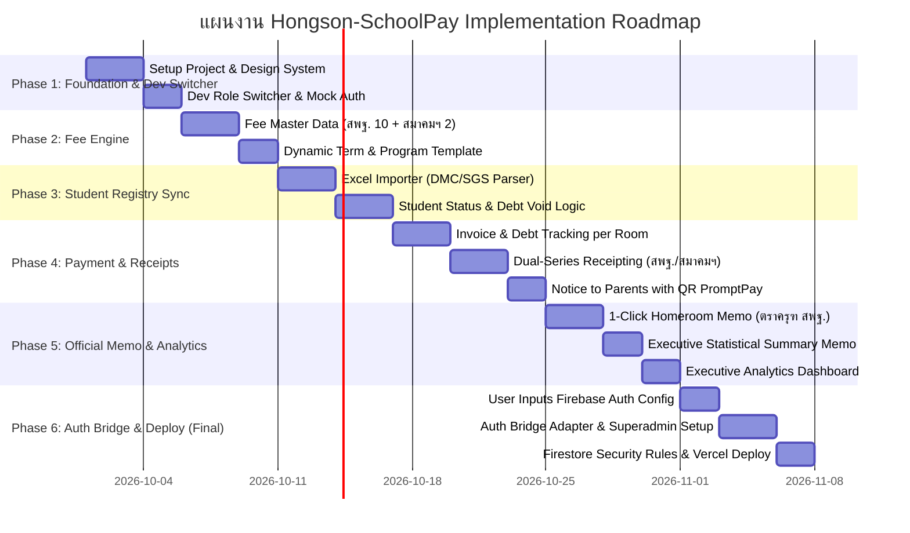
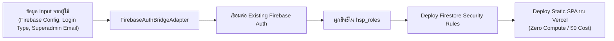

# แผนการพัฒนาและส่งมอบระบบ Hongson-SchoolPay (Implementation Plan)
### โครงการ: ระบบติดตามการชำระและค้างชำระเงินบำรุงการศึกษาและเงินสมาคมผู้ปกครองและครู

---

## กลยุทธ์การแบ่งเฟส: "Feature-First, Auth-Bridge-Last"

เพื่อให้การพัฒนาสามารถเริ่มลงมือทำได้ทันทีโดยไม่ถูกบล็อกด้วยการรอการตั้งค่าหรือเตรียมข้อมูล Firebase Auth เดิมของโรงเรียน:
1. **เฟสที่ 1 ถึง 5 (Core Features & Business Logic):** 
   - พัฒนาด้วยสถาปัตยกรรม **Pluggable Auth Interface**
   - มี **"Dev Role Switcher (แถบสลับบทบาทจำลอง)"** ในตัว ทำให้สามารถสลับหน้าจอทดสอบได้ทันทีใน 1 คลิก ระหว่าง:
     - 👑 Superadmin
     - 🏛️ ผู้บริหาร (ผอ. / รอง ผอ.)
     - 💳 เจ้าหน้าที่การเงิน
     - 👩‍🏫 ครูการเงิน
     - 🎒 คุณครูที่ปรึกษา (ระบุห้องได้ เช่น ม.1/1, ม.4/1)
   - พัฒนาฟังก์ชันการเงิน, การซิงค์นักเรียนย้ายห้อง/ลาออก, ระบบออกใบเสร็จ 2 เล่ม, และบันทึกข้อความราชการ สพฐ. ตราครุฑ ให้เสร็จสมบูรณ์ 100%
2. **เฟสที่ 6 (Auth Bridge & Production Integration - เฟสสุดท้าย):**
   - นำข้อมูลการเชื่อมต่อ Firebase Auth จากที่คุณเตรียมไว้ (Input) เข้ามาเสียบผ่าน Adapter Layer
   - ปิด Dev Role Switcher และสลับไปใช้ Live Firebase Auth Bridge
   - นำ Firestore Security Rules ขึ้น Production และ Deploy ขึ้น Vercel แบบ 0 Server Compute

---



---

## รายละเอียดแต่ละ Phase

### 🚀 Phase 1: โครงสร้างพื้นฐาน, UI Shell และ Dev Role Switcher
**เป้าหมาย:** วางรากฐานระบบ ออกแบบโครงสร้างธีม และสร้าง Mock Auth Switcher เพื่อให้ทดสอบได้ทุกบทบาทในทันที

* **งานที่ดำเนินการ:**
  1. สร้างโปรเจกต์ Vite + React (TypeScript) + Vanilla CSS / Tailwind (Modern Government Clean & Responsive Theme)
  2. กำหนด Design Tokens: สีทางการเงิน (Deep Navy `#1E293B`, Emerald `#059669`, Amber `#D97706`), ฟอนต์ `Prompt` สำหรับเว็บ และ `TH Sarabun PSK` สำหรับงานพิมพ์ราชการ
  3. ออกแบบ `IAuthProvider` Interface:
     ```typescript
     interface IAuthProvider {
       currentUser: UserProfile | null;
       login(role?: UserRole): Promise<void>;
       logout(): Promise<void>;
       switchRole(role: UserRole, assignedRooms?: string[]): void;
     }
     ```
  4. สร้าง **Dev Role Switcher Floating Widget** (แสดงเฉพาะตอน Dev Mode) ให้คลิกเปลี่ยน Role เพื่อทดสอบ UI ของแต่ละฝ่ายได้ทันที
  5. วาง Layouts:
     - `AdminLayout`: เมนูสำหรับ ฝ่ายการเงิน และ ผู้บริหาร (Sidebar, สถิติ, ตั้งค่า)
     - `HomeroomLayout`: เมนูเรียบง่ายสำหรับ คุณครูที่ปรึกษา (ห้องของฉัน, พิมพ์บันทึกข้อความ, สลิป)
     - `PrintLayout`: หน้าว่างไร้ขอบสำหรับพิมพ์เอกสารราชการ A4 โดยเฉพาะ

* **ผลลัพธ์ที่ได้ (Deliverables):**
  - โปรเจกต์รันได้ มีหน้า Dashboard โครงร่างครบทุกฝ่าย
  - สลับ Role ทดสอบได้ลื่นไหล ไม่ต้องผูก Auth จริงในขั้นตอนนี้

---

### 💰 Phase 2: Fee Master Data & Invoicing Engine (โครงสร้างประเภทเงิน)
**เป้าหมาย:** สร้างระบบกำหนดประเภทเงินตามข้อกำหนด [requirement.jpg](file:///d:/Hongson-SchoolPay/requirement.jpg) ครบถ้วน ทั้ง สพฐ. 10 รายการ และ สมาคมฯ 2 รายการ

* **งานที่ดำเนินการ:**
  1. สร้าง Master Data สำหรับประเภทเงิน 2 กลุ่มใบเสร็จ:
     - **ใบเสร็จ สพฐ.:**
       - 1.1.1 เงินบำรุงการศึกษา (ค่าจ้างครู บุคลากรและครูต่างชาติ)
       - 1.1.2 เงินห้องเรียนวิทย์พิเศษ ม.ปลาย
       - 1.1.3 เงินห้องเรียนวิทย์คอม ม.ปลาย
       - 1.1.4 เงินห้องเรียนวิทย์สุขภาพ ม.ปลาย
       - 1.1.5 เงินห้องเรียนเตรียมวิทย์ ม.ต้น
       - 1.1.6 เงินห้องเรียนเตรียมวิทย์คอม ม.ต้น
       - 1.1.7 เงินห้องเรียนเตรียมวิทย์ภาษา ม.ต้น
       - 1.1.8 เงินประกันอุบัติเหตุ
       - 1.2 เงินระดมทรัพยากร
     - **ใบเสร็จสมาคมผู้ปกครองและครู:**
       - 2.1 เงินค่าสมัครสมาคมผู้ปกครองและครู (แรกเข้า ม.1 และ ม.4)
       - 2.2 เงินค่าบำรุงสมาคมรายปี
  2. สร้างหน้าจอ **"ตั้งค่าอัตราค่าเทอมรายภาคเรียน" (Term Fee Matrix):**
     - กำหนดจำนวนเงินของแต่ละรายการแยกตามระดับชั้น (ม.1 - ม.6) และแผนการเรียน
  3. ระบบคำนวณและสร้าง Invoice อัตโนมัติ (Automated Invoice Generator) เมื่อเริ่มต้นภาคเรียนใหม่

* **ผลลัพธ์ที่ได้ (Deliverables):**
  - หน้าจอจัดการประเภทเงินและอัตราค่าธรรมเนียม
  - ระบบตั้งยอดหนี้รายบุคคลที่ถูกต้องตามห้องเรียนและแผนการเรียน

---

### 👥 Phase 3: Student Registry Sync & Lifecycle (งานทะเบียนและการย้ายห้อง)
**เป้าหมาย:** แก้ปัญหาสำคัญตามข้อ 4 ของโจทย์ (ข้อมูลนักเรียนลาออก หรือย้ายห้องเรียน ไม่ให้ยอดค้างชำระคลาดเคลื่อน)

* **งานที่ดำเนินการ:**
  1. **Client-side Excel Importer:**
     - ใช้ SheetJS (`xlsx`) นำเข้ารายชื่อนักเรียนจากไฟล์ทะเบียน (DMC / SGS / Excel) โดยประมวลผลบนเบราว์เซอร์ ไม่ผ่านเซิร์ฟเวอร์
     - ตรวจจับความซ้ำซ้อนของรหัสนักเรียนและเลขประจำตัวประชาชน
  2. **Student Lifecycle & Debt Recalculation Engine:**
     - **กรณีย้ายห้องเรียน (Room Transfer):**
       - โอนนักเรียนและยอดค้างชำระไปยังห้องใหม่
       - ยอดสถิติห้องเดิมลดลงทันที ยอดห้องใหม่ปรับเพิ่มอัตโนมัติ
     - **กรณีลาออก / ย้ายสถานศึกษา (Drop Out / Discharge):**
       - ปรับสถานะใบแจ้งหนี้เป็น `waived` (ยกเลิกหนี้) พร้อมบันทึกเลขที่หนังสือคำสั่งลาออก
       - ยอดหนี้ค้างรวมของห้องเรียนและโรงเรียนจะถูกหักออกทันที ไม่เกิดหนี้ค้างลอย
  3. **คำร้องเปลี่ยนสถานะ (Status Request Workflow):**
     - คุณครูที่ปรึกษาสามารถกด "แจ้งนักเรียนย้ายห้อง / ลาออก" ส่งเรื่องให้ฝ่ายการเงินกดยืนยันใน 1 คลิก

* **ผลลัพธ์ที่ได้ (Deliverables):**
  - หน้าจอนำเข้า Excel นักเรียนพร้อมตัวอย่างไฟล์ Template
  - ฟังก์ชันย้ายห้องและจำหน่ายนักเรียน พร้อมการปรับปรุงยอดหนี้แบบเรียลไทม์

---

### 💳 Phase 4: Payment Tracking, Dual-Receipts & Homeroom Portal
**เป้าหมาย:** ระบบรับชำระเงิน, ออกใบเสร็จ 2 เล่มแยกรันนัมเบอร์, หน้าจอครูที่ปรึกษา และพิมพ์หนังสือเตือนผู้ปกครอง

* **งานที่ดำเนินการ:**
  1. **หน้าจอครูที่ปรึกษา (Homeroom Portal):**
     - ตรวจสอบสถานะการชำระเงินของนักเรียนในห้องตนเอง (เขียว = ครบ, เหลือง = ผ่อนชำระ/ค้างบางส่วน, แดง = ยังไม่ชำระ)
     - บันทึกการติดตาม (Follow-up Notes เช่น โทรหาผู้ปกครองแล้ว แจ้งจะชำระสิ้นเดือน)
     - ถ่ายภาพหรือแนบสลิปโอนเงินที่ผู้ปกครองส่งมาในไลน์ ส่งให้การเงินตรวจสอบ
  2. **หน้าจอการเงินรับชำระและออกใบเสร็จ (Payment & Receipting):**
     - บันทึกรับชำระเงินสด / ตรวจสอบสลิปโอนเงิน
     - ออกใบเสร็จรับเงิน 2 เล่มแยกรันนัมเบอร์:
       - **เล่ม 1:** `ใบเสร็จรับเงิน สพฐ. (บำรุงการศึกษา)`
       - **เล่ม 2:** `ใบเสร็จรับเงิน สมาคมผู้ปกครองและครู`
     - รองรับการชำระบางส่วน (ผ่อนชำระ)
  3. **หนังสือแจ้งเตือนผู้ปกครอง (Notice Letter Generator):**
     - สั่งพิมพ์หนังสือแจ้งเตือนรายบุคคล พร้อมยอดค้างแยกประเภทเงิน และ QR Code PromptPay ของโรงเรียนสำหรับชำระเงิน

* **ผลลัพธ์ที่ได้ (Deliverables):**
  - หน้าจอติดตามค่าเทอมรายห้องสำหรับครู
  - หน้าจอบันทึกชำระและพิมพ์ใบเสร็จ 2 เล่ม
  - ระบบพิมพ์จดหมายเตือนผู้ปกครองพร้อม QR Code

---

### 📄 Phase 5: 1-Click Official Memo Generator & Executive Analytics
**เป้าหมาย:** ฟีเจอร์เด่นตามข้อ 3 และข้อ 5 ของ [requirement.jpg](file:///d:/Hongson-SchoolPay/requirement.jpg) บันทึกข้อความราชการ สพฐ. ตราครุฑ 3 ซม.

* **งานที่ดำเนินการ:**
  1. **ระบบสร้างบันทึกข้อความสำหรับครูที่ปรึกษา (Homeroom Official Memo):**
     - ดึงข้อมูลอัตโนมัติ: ห้องเรียน, จำนวนนักเรียนทั้งหมด, จำนวนที่ชำระครบ, จำนวนที่ค้างชำระ
     - ตารางรายชื่อนักเรียนที่ค้างชำระ ยอดเงิน สพฐ., ยอดเงินสมาคมฯ, ยอดรวม และเหตุผล
     - ฟอร์แมตถูกต้องตามระเบียบงานสารบรรณสำนักนายกรัฐมนตรี (A4, ตราครุฑ 3 ซม., ฟอนต์ TH Sarabun PSK 16pt, เลขที่หนังสือ, คำขึ้นต้น, คำลงท้าย, ช่องลงนาม ผอ.)
     - สั่งพิมพ์ได้ทันทีผ่าน Browser Print หรือ Export เป็น PDF
  2. **ระบบสร้างบันทึกข้อความรายงานสถิติเสนอฝ่ายบริหาร (Executive Statistical Memo):**
     - รวบรวมสถิติภาพรวมทั้งโรงเรียน แยกตามระดับชั้น ม.1 - ม.6
     - รายงานสถิติ % การจัดเก็บ และยอดค้างชำระแยก 2 กลุ่มใบเสร็จ เสนอ ผอ.
  3. **Executive Financial Dashboard:**
     - แดชบอร์ดสรุปสถิติสำหรับผู้บริหาร มีกราฟแท่งและกราฟวงกลมแสดงสัดส่วนการชำระเงิน

* **ผลลัพธ์ที่ได้ (Deliverables):**
  - ระบบสร้างบันทึกข้อความราชการทั้งฝั่งครูที่ปรึกษาและฝั่งการเงิน
  - Dashboard สถิติสำหรับผู้บริหาร

---

### 🔐 Phase 6: Auth Bridge Integration, Superadmin Setup & Production Deployment (เฟสสุดท้าย)
**เป้าหมาย:** นำข้อมูลระบบ Auth เดิมของโรงเรียนมาเชื่อมต่อ, เปิดระบบ RBAC จริง, ทดสอบความปลอดภัย และ Deploy สู่ Production



* **สิ่งที่ต้องการให้คุณ Input ในเฟสนี้ (User Input Checklist):**
  1. [ ] **Firebase Web App Config:**
     - `apiKey`, `authDomain`, `projectId`, `storageBucket`, `messagingSenderId`, `appId`
  2. [ ] **รูปแบบการล็อกอินของ Firebase Auth เดิม:**
     - ล็อกอินด้วย Google Workspace ของโรงเรียน (เช่น `@school.ac.th`) หรือ Email/Password หรือ Phone Number
  3. [ ] **อีเมลของผู้ที่จะเป็น Superadmin คนแรก:**
     - เพื่อใช้สำหรับระบบ First-claim Bootstrapping
  4. [ ] **(ถ้ามี) รายชื่อหรือรูปแบบการแมปครูกับห้องเรียนเริ่มต้น:**
     - เช่น สามารถใส่ผ่านหน้าจอจัดการสิทธิ์ในระบบได้โดยตรง หรือต้องการ Import จากไฟล์

* **งานที่ดำเนินการใน Phase นี้:**
  1. ปิด Dev Role Switcher สลับไปใช้ `FirebaseAuthBridgeAdapter` ที่ต่อกับ Firebase Auth จริง
  2. เพิ่มหน้าจอ **"จัดการสิทธิ์ผู้ใช้งาน (User & Role Management)"** ให้ Superadmin กำหนดบทบาทของครูแต่ละคนและระบุห้องที่ปรึกษา
  3. ติดตั้ง Firestore Security Rules ควบคุมสิทธิ์ระดับ Row/Document เพื่อความปลอดภัย 100%
  4. ตั้งค่า Build Pipeline สำหรับ Vercel (ไฟล์ `vercel.json` แบบ Pure Static Hosting ไม่เรียกใช้ Serverless Function)
  5. ทดสอบระบบจริง (End-to-End Testing) และส่งมอบระบบ

---

## สรุปภาพรวมและขั้นตอนต่อไป

| Phase | หัวข้อหลัก | การพึ่งพา Auth จริง | ผู้ใช้ต้องส่งข้อมูลอะไร? |
| :---: | :--- | :---: | :---: |
| **Phase 1** | โครงสร้างพื้นฐาน, UI Shell, Dev Role Switcher | ❌ ไม่ต้อง (ใช้ Mock Switcher) | ยืนยันรูปแบบหน้าตา/ธีม |
| **Phase 2** | โครงสร้างประเภทเงิน (สพฐ. 10 + สมาคมฯ 2) | ❌ ไม่ต้อง | ตรวจสอบความถูกต้องของรายการเงิน |
| **Phase 3** | ซิงค์งานทะเบียน, จัดการนักเรียนย้ายห้อง/ลาออก | ❌ ไม่ต้อง | ตัวอย่างไฟล์รายชื่อนักเรียน (Excel) |
| **Phase 4** | ระบบรับเงิน, ใบเสร็จ 2 เล่ม, พอร์ทัลครูที่ปรึกษา | ❌ ไม่ต้อง | รูปแบบเลขที่ใบเสร็จ/บัญชีรับโอน |
| **Phase 5** | บันทึกข้อความราชการ สพฐ. ตราครุฑ & Dashboard ผู้บริหาร | ❌ ไม่ต้อง | ชื่อโรงเรียน, ข้อมูลหัวหนังสือราชการ |
| **Phase 6 (Final)** | **Auth Bridge, สิทธิ์ Superadmin, Security Rules & Vercel Deploy** |  **เชื่อมต่อจริง** | **Firebase Config + อีเมล Superadmin** |

แผนการนี้จะทำให้เราสามารถลงมือพัฒนา **Phase 1 (Setup Foundation & Dev Role Switcher)** ได้ทันที โดยที่คุณสามารถเตรียมข้อมูล Auth ไว้ส่งให้ใน Phase 6 ได้อย่างสบายใจครับ!
